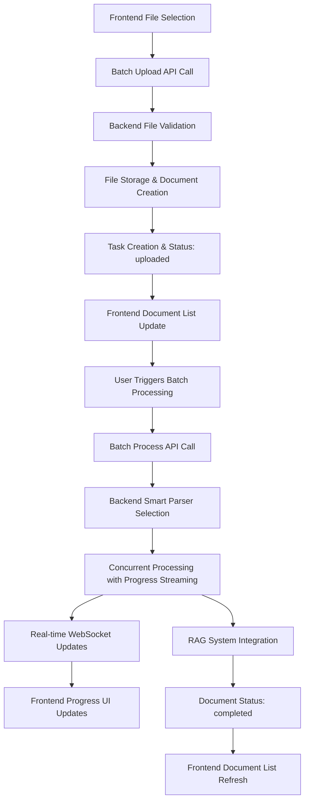
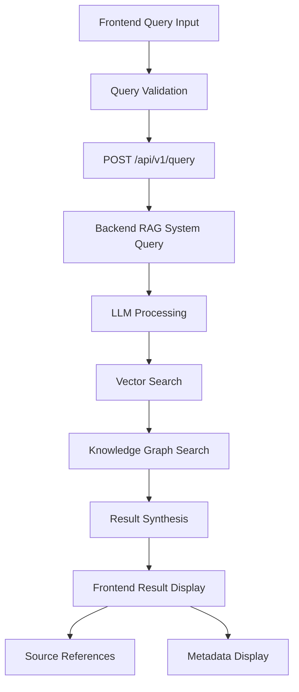

# Frontend-Backend API Mapping Analysis

## Overview

This document analyzes the integration between the RAG-Anything frontend (React/TypeScript) and backend (FastAPI) through their API interfaces, focusing on usage patterns, data flow, and optimization strategies.

---

## Frontend Architecture

### Technology Stack
- **Framework**: React with TypeScript
- **HTTP Client**: Axios
- **Build Tool**: Vite
- **State Management**: Component-based (no global state management detected)

### Frontend API Client Structure

#### Core API Utilities

**Location**: `/webui/src/utils/batchProcessor.ts`

The frontend implements sophisticated batch processing logic that optimizes API calls:

```typescript
// Batch Processing Strategy
export async function batchProcessDocuments(
  documentIds: string[],
  onProgress?: (completed: number, total: number, results: any[]) => void,
  parser?: string,
  parseMethod?: string
): Promise<{
  successCount: number
  failCount: number
  results: BatchProcessResult<any>[]
  errors: string[]
  batchOperationId?: string
}>
```

**Key Frontend Optimizations**:
1. **Single Batch Call**: Uses `POST /api/v1/documents/process/batch` instead of N parallel individual calls
2. **Progress Callbacks**: Real-time progress updates through callback functions
3. **Error Aggregation**: Collects and categorizes errors from batch operations
4. **Retry Logic**: Built-in retry mechanisms with exponential backoff

---

## API Integration Patterns

### 1. Document Upload Flow

#### Single Upload
```typescript
// Frontend Request Pattern
const formData = new FormData()
formData.append('file', file)

const response = await axios.post('/api/v1/documents/upload', formData, {
  headers: { 'Content-Type': 'multipart/form-data' },
  onUploadProgress: (progressEvent) => {
    const progress = Math.round((progressEvent.loaded * 100) / progressEvent.total!)
    onProgress?.(file, progress)
  }
})
```

**Backend Response Pattern**:
```json
{
  "success": true,
  "message": "Document uploaded successfully, ready for manual processing",
  "task_id": "uuid-string",
  "document_id": "uuid-string",
  "file_name": "document.pdf",
  "file_size": 1024000,
  "status": "uploaded"
}
```

#### Batch Upload
The frontend implements parallel upload with concurrency control:

```typescript
// Frontend: Parallel upload with concurrency limits
const results = await BatchProcessor.processInParallel(
  files,
  async (file) => {
    // Individual upload logic
  },
  {
    maxConcurrent: PERFORMANCE_CONFIG.upload.maxConcurrent,
    chunkSize: PERFORMANCE_CONFIG.upload.maxConcurrent
  }
)
```

### 2. Document Processing Flow

#### Traditional Approach (Avoided)
```typescript
// OLD WAY: N parallel individual calls (inefficient)
// for each documentId:
//   POST /api/v1/documents/{document_id}/process
```

#### Optimized Batch Approach (Current)
```typescript
// NEW WAY: Single batch call (efficient)
POST /api/v1/documents/process/batch
{
  "document_ids": ["id1", "id2", "id3"],
  "parser": "mineru",
  "parse_method": "auto"
}
```

**Backend Batch Response**:
```json
{
  "success": true,
  "started_count": 2,
  "failed_count": 1,
  "total_requested": 3,
  "results": [
    {
      "document_id": "id1",
      "file_name": "doc1.pdf",
      "status": "success",
      "message": "Processing started",
      "task_id": "task-uuid-1"
    }
  ],
  "batch_operation_id": "batch-uuid",
  "cache_performance": {
    "cache_hits": 0,
    "cache_misses": 3,
    "cache_hit_ratio": 0.0,
    "total_time_saved": 0.0
  }
}
```

### 3. Real-time Progress Tracking

#### WebSocket Integration
```typescript
// Frontend WebSocket Connection Pattern
const ws = new WebSocket(`ws://127.0.0.1:8001/api/v1/documents/progress`)

ws.onmessage = (event) => {
  const logData = JSON.parse(event.data)
  if (logData.type === 'log') {
    handleProgressLog(logData)
  }
}
```

**Backend WebSocket Messages**:
```json
{
  "type": "log",
  "level": "info",
  "message": "🔧 开始文档解析阶段...",
  "timestamp": "2024-01-01T12:00:00",
  "source": "api_processing"
}
```

---

## Performance Configuration

### Frontend Performance Settings
**Location**: `/webui/src/config/performance.config.ts`

```typescript
export const PERFORMANCE_CONFIG = {
  batch: {
    maxConcurrentProcess: 3,
    processChunkSize: 5,
    maxRetries: 3,
    retryDelay: 1000
  },
  upload: {
    maxConcurrent: 2
  }
}
```

### Backend Concurrency Controls
The backend implements sophisticated concurrency management:

- **Environment Variables**:
  - `MAX_CONCURRENT_TASKS=3`
  - `MAX_CONCURRENT_PROCESSING=3`
- **Dynamic Resource Management**: GPU/CPU detection and allocation
- **Queue Management**: Task queuing with priority handling

---

## API Usage Patterns Analysis

### 1. Efficient Batch Operations

#### Frontend Pattern
```typescript
// Smart batch processing avoids API overload
const batchResult = await batchProcessDocuments(
  selectedDocumentIds,
  (completed, total, results) => {
    // Progress callback
    updateProgressUI(completed, total)
  },
  selectedParser,
  selectedMethod
)
```

#### Backend Optimization
- **Single Transaction**: All documents processed in one batch operation
- **Internal Concurrency**: Backend manages optimal concurrency internally
- **Resource Pooling**: Shared resources across batch items
- **Progress Streaming**: Real-time progress through WebSocket

### 2. Error Handling Patterns

#### Frontend Error Categorization
```typescript
// Frontend handles different error types
try {
  const result = await batchProcessDocuments(documentIds)
  handleSuccess(result)
} catch (error) {
  if (axios.isAxiosError(error)) {
    const apiError = error.response?.data
    handleAPIError(apiError)
  } else {
    handleNetworkError(error)
  }
}
```

#### Backend Error Response Structure
```json
{
  "error": "批量处理失败: 内存不足",
  "error_category": "resource_limitation",
  "error_severity": "high",
  "is_recoverable": true,
  "suggested_solution": "减少批量处理的文档数量或释放系统内存",
  "system_warnings": ["内存使用率过高: 89%"],
  "timestamp": "2024-01-01T12:00:00"
}
```

### 3. Progress Monitoring

#### Multi-layered Progress Tracking
1. **HTTP Progress**: Upload/request progress
2. **WebSocket Progress**: Real-time processing updates
3. **Batch Progress**: Overall batch completion status

```typescript
// Frontend Progress Integration
const progressHandler = {
  onHttpProgress: (loaded, total) => {
    setUploadProgress((loaded / total) * 100)
  },
  onWebSocketProgress: (logData) => {
    appendProcessingLog(logData.message)
  },
  onBatchProgress: (completed, total) => {
    setBatchProgress((completed / total) * 100)
  }
}
```

---

## Data Flow Architecture

### 1. Document Lifecycle



### 2. Query Flow



---

## Integration Quality Assessment

### Strengths ✅

1. **Optimized Batch Operations**: Avoids N+1 API call problem
2. **Real-time Updates**: WebSocket integration for live progress
3. **Error Handling**: Comprehensive error categorization and recovery
4. **Progress Tracking**: Multi-layered progress monitoring
5. **Performance Configuration**: Configurable concurrency and timeouts
6. **Type Safety**: Full TypeScript integration with proper typing
7. **Retry Logic**: Built-in retry mechanisms with backoff
8. **Resource Management**: Intelligent concurrency control

### Areas for Improvement ⚠️

1. **Authentication**: No authentication integration
2. **State Management**: No centralized state management for complex operations
3. **API Client**: No centralized API client with interceptors
4. **Caching**: No client-side response caching
5. **Offline Support**: No offline capability or request queuing
6. **API Versioning**: No version management for API compatibility
7. **Request Cancellation**: Limited request cancellation support
8. **Error Recovery**: Could benefit from automatic retry with circuit breaker

---

## Performance Optimization Recommendations

### 1. Frontend Optimizations

#### Implement Centralized API Client
```typescript
// Recommended: Centralized API client with interceptors
class ApiClient {
  private axios: AxiosInstance

  constructor() {
    this.axios = axios.create({
      baseURL: '/api/v1',
      timeout: 30000
    })
    
    this.setupInterceptors()
  }

  private setupInterceptors() {
    // Request interceptor for auth, logging
    this.axios.interceptors.request.use(
      (config) => {
        // Add auth headers, request ID, etc.
        return config
      }
    )
    
    // Response interceptor for error handling, caching
    this.axios.interceptors.response.use(
      (response) => response,
      (error) => this.handleError(error)
    )
  }
}
```

#### Implement Request Caching
```typescript
// Response caching for frequently accessed data
const cacheConfig = {
  '/api/v1/documents': { ttl: 5000 }, // 5s cache
  '/api/v1/system/status': { ttl: 10000 }, // 10s cache
}
```

### 2. Backend Optimizations

#### API Response Optimization
```python
# Current: Full document objects in responses
# Optimized: Lightweight document summaries with pagination
@app.get("/api/v1/documents")
async def list_documents(
    page: int = 1,
    limit: int = 50,
    status_filter: Optional[str] = None,
    include_metadata: bool = False
):
    # Return paginated, filtered results
    pass
```

#### WebSocket Connection Pooling
```python
# Implement connection pooling for WebSocket management
class WebSocketManager:
    def __init__(self):
        self.connections = {}
        self.connection_pool = ConnectionPool()
    
    async def broadcast_to_group(self, group: str, message: dict):
        # Efficient group broadcasting
        pass
```

---

## Security Considerations

### Current State
- **No Authentication**: All endpoints are open access
- **No Request Validation**: Limited input validation
- **CORS**: Permissive CORS policy allows all origins

### Recommended Security Integration

#### Authentication Flow
```typescript
// Frontend: Auth integration
class AuthenticatedApiClient extends ApiClient {
  async login(credentials: LoginRequest): Promise<AuthResponse> {
    const response = await this.axios.post('/auth/login', credentials)
    this.setAuthToken(response.data.token)
    return response.data
  }
  
  private setAuthToken(token: string) {
    this.axios.defaults.headers.common['Authorization'] = `Bearer ${token}`
    localStorage.setItem('auth_token', token)
  }
}
```

#### Backend Security Middleware
```python
# JWT authentication middleware
@app.middleware("http")
async def auth_middleware(request: Request, call_next):
    if request.url.path.startswith("/api/v1/"):
        token = request.headers.get("Authorization")
        if not validate_jwt_token(token):
            return JSONResponse(
                status_code=401,
                content={"error": "Invalid authentication token"}
            )
    return await call_next(request)
```

---

## Conclusion

The RAG-Anything frontend-backend integration demonstrates sophisticated API optimization patterns, particularly in batch processing and real-time progress tracking. The system successfully avoids common performance pitfalls through intelligent batching and WebSocket streaming.

### Integration Quality Score: 8.0/10
- **Performance Optimization**: 9/10
- **Real-time Features**: 9/10  
- **Error Handling**: 8/10
- **Type Safety**: 8/10
- **Security Integration**: 3/10 (not implemented)
- **Maintainability**: 7/10

The primary areas for improvement are security integration and centralized API client management, while the batch processing and progress tracking implementations serve as excellent examples of efficient API integration patterns.