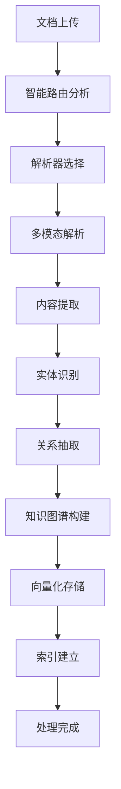
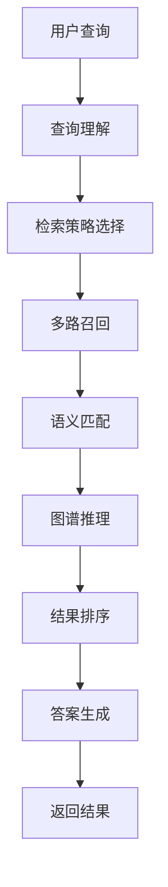

# RAG System 项目架构概览

## 项目总体结构

```
ragsystem/
├── 🚀 RAG-Anything/           # 核心RAG系统
├── 🌐 webui/                  # React前端界面
├── 📚 LightRAG/               # 上游LightRAG库
├── 🔧 docs/                   # 项目文档
├── 💾 uploads/                # 文档上传目录
├── 📊 output/                 # 解析输出目录
├── 🗄️ rag_storage/            # RAG数据存储
└── ⚙️ 配置与部署文件
```

## 🚀 RAG-Anything 核心系统

### API 服务层 (`RAG-Anything/api/`)

```
api/
├── 🎯 rag_api_server.py              # 主API服务器
├── 🔗 database_config.py             # 数据库配置
├── 🧠 smart_parser_router.py         # 智能解析路由
├── 💾 cache_enhanced_processor.py    # 缓存增强处理器
├── 📊 detailed_status_tracker.py     # 详细状态跟踪
├── 🔄 websocket_log_handler.py       # WebSocket日志处理
├── 🚨 enhanced_error_handler.py      # 增强错误处理
├── 📈 advanced_progress_tracker.py   # 高级进度跟踪
├── 📋 cache_statistics.py            # 缓存统计
└── 🔧 性能优化模块
    ├── performance_benchmark_phase2.py
    ├── database_optimization_phase2.py
    └── neo4j_optimization_phase2.py
```

### 核心业务层 (`RAG-Anything/raganything/`)

```
raganything/
├── 🎯 raganything.py          # 主业务逻辑
├── 📄 processor.py            # 文档处理器
├── 🔀 parser.py               # 解析器框架
├── 📦 batch.py                # 批量处理
├── ❓ query.py                # 查询处理
├── ⚙️ config.py               # 配置管理
├── 🛠️ utils.py                # 工具函数
├── 💬 prompt.py               # 提示词管理
├── 🖼️ image_utils.py          # 图像处理工具
├── 📝 enhanced_markdown.py    # 增强Markdown处理
├── 🎭 modalprocessors.py      # 多模态处理器
├── 🔧 custom_models.py        # 自定义模型
└── 🔄 batch_parser.py         # 批量解析器
```

## 🌐 Web UI 前端系统

### React 前端架构 (`webui/`)

```
webui/src/
├── 📱 pages/                  # 页面组件
│   ├── DocumentManagement.tsx # 文档管理页面
│   ├── QueryInterface.tsx     # 查询界面
│   └── GraphVisualization.tsx # 图谱可视化
├── 🧩 components/             # 通用组件
│   ├── FileUploader.tsx       # 文件上传组件
│   ├── ProgressTracker.tsx    # 进度追踪组件
│   ├── ChatInterface.tsx      # 聊天界面
│   └── NetworkGraph.tsx       # 网络图组件
├── ⚙️ config/                 # 配置文件
└── 🛠️ utils/                  # 前端工具
```

### 技术栈
- **框架**: React 18 + TypeScript + Vite
- **UI库**: Ant Design + 自定义组件
- **可视化**: D3.js + Force Graph
- **状态管理**: React Hooks
- **网络请求**: Axios + WebSocket

## 💾 数据存储架构

### 多层存储设计

```
存储层级:
├── 🐘 PostgreSQL              # 主数据存储
│   ├── 文档状态表 (lightrag_doc_status)
│   ├── KV存储 (lightrag_kv_*) 
│   └── 向量存储 (pgvector)
├── 🕸️ Neo4j                    # 知识图谱
│   ├── 实体节点 (Entities)
│   └── 关系边 (Relationships)
├── 📄 GraphML文件              # Chunk-实体关联
│   └── graph_chunk_entity_relation.graphml
└── 🚀 Redis                    # 缓存层 (可选)
```

### 存储分工详解

| 存储类型 | 存储内容 | 作用 |
|---------|---------|------|
| **PostgreSQL** | 文档状态、KV数据、向量索引 | 结构化数据存储 |
| **Neo4j** | 实体、关系、语义图谱 | 知识图谱查询 |
| **GraphML** | Chunk-实体映射关系 | 文档级别关联 |
| **Redis** | 缓存、会话、临时数据 | 性能优化 |

## 🔄 系统工作流

### 文档处理流程



### 查询处理流程



## 🔧 核心技术特性

### 1. 智能解析系统
- **多格式支持**: PDF, Word, Excel, PowerPoint, 图片, 视频
- **解析器路由**: 自动选择最优解析引擎
- **质量保证**: 多阶段验证和错误恢复

### 2. 知识图谱构建
- **实体抽取**: 基于NLP的智能实体识别
- **关系推理**: 语义关系自动发现
- **图谱存储**: Neo4j + GraphML 双存储

### 3. 增强检索系统
- **混合检索**: 向量检索 + 关键词检索 + 图谱检索
- **语义理解**: 基于大模型的深度语义匹配
- **上下文融合**: 多文档信息整合

### 4. 缓存优化系统
- **多层缓存**: 解析缓存 + LLM缓存 + 查询缓存
- **智能预热**: 预测性缓存加载
- **统计监控**: 实时性能监控

## 🛠️ 部署架构

### 容器化部署

```yaml
服务组件:
├── 🚀 API服务 (Python/FastAPI)
├── 🌐 Web界面 (Nginx/React)
├── 🐘 PostgreSQL + pgvector
├── 🕸️ Neo4j Community
├── 🚀 Redis (可选)
└── 🔍 监控日志 (可选)
```

### 网络架构
```
用户浏览器
    ↓ HTTP/WebSocket
Nginx反向代理
    ↓
FastAPI服务
    ↓
┌─────────────────┐
│ PostgreSQL      │
│ Neo4j          │
│ Redis          │
└─────────────────┘
```

## 📊 性能指标

### 处理能力
- **文档解析**: 平均2-5秒/PDF页面
- **批量处理**: 支持并发处理，可配置工作线程
- **查询响应**: 平均200-800ms
- **并发支持**: 可扩展到多实例部署

### 存储规模
- **单文档**: 支持100MB以内文件
- **总容量**: 理论无限制（取决于存储配置）
- **知识图谱**: 支持百万级实体和关系

## 🔮 技术创新点

### 1. 混合存储架构
- 充分发挥不同数据库优势
- 实现数据的高效存取和查询

### 2. 智能解析路由
- 根据文件特征自动选择解析策略
- 提升解析质量和效率

### 3. 实时进度跟踪
- WebSocket实时通信
- 细粒度进度反馈

### 4. 缓存智能优化
- 多层缓存设计
- 自适应缓存策略

---
*文档生成时间: 2025-09-09*  
*架构版本: RAG-Anything v2.0*